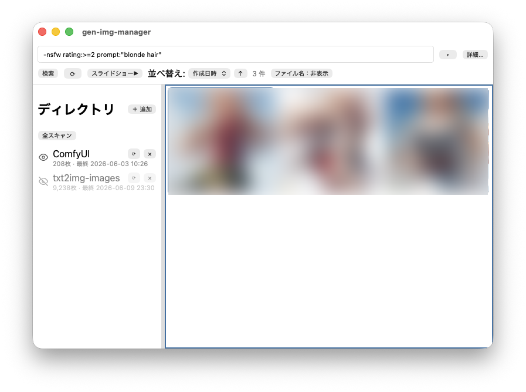

# gen-img-manager

AI 生成画像（Stable Diffusion WebUI / ComfyUI など）をローカルで管理するデスクトップアプリ。
画像に埋め込まれた生成メタデータ（プロンプト・モデル・Seed 等）を取り込み、検索・閲覧・レーティングできます。

- **Tauri 2**（Rust バックエンド）＋ **React 19 + TypeScript + Vite**
- ライブラリはローカル **SQLite**（FTS5 全文検索）。外部サービスへの送信は一切なし



## 主な機能

- **取り込み**: 登録ディレクトリを走査し、PNG（tEXt）/ JPEG / WebP（EXIF UserComment）から A1111・ComfyUI のメタデータを抽出。サムネイル自動生成
- **検索 DSL**: `prompt:1girl rating:>=4 -blurry` のようなクエリで全文検索＋構造化条件（範囲・集合・日付）を記述
- **レーティング**: `0`〜`5` キーで即評価。XMP サイドカーへの自動書き出し、未評価画像へ自動で送る入力モード
- **ビューア**: 全体フィット / 等倍 / Fill / 任意倍率ズーム、メタデータパネル、ゴミ箱への移動
- **スライドショー**: 別ウィンドウで再生。間隔・ループ・ランダム・フルスクリーン対応
- **オフライン耐性**: 切断されたネットワークドライブで UI が固まらないよう到達性をタイムアウト判定

エンドユーザー向けの操作説明は **[docs/usage.html](docs/usage.html)** を参照してください（ブラウザで開けます）。

## 検索クエリの例

```
prompt:"best quality" rating:>=4 -blurry
forest OR mountain width:>=1024 steps:20..40
created:2025-01-01..2025-01-31 tool:comfyui
rating:none,1,2 model:sdxl
```

対応フィールド: `prompt:` `negative:` `model:` `filename:` `sampler:` `tool:` `rating:` `width:` `height:` `pixels:` `steps:` `seed:` `created:` `modified:`
演算子: 比較（`>=` `<=` `>` `<`）、範囲（`A..B`）、集合（`1,3,5`）、除外（`-`）、OR、フレーズ（`"..."`）

## 開発

### 必要環境

- Node.js（LTS 推奨）＋ pnpm
- Rust toolchain（[Tauri 2 の前提条件](https://v2.tauri.app/start/prerequisites/) を参照）

### コマンド

```bash
pnpm install

npm run dev          # フロントのみ（Vite。Tauri ウィンドウは開かない）
npm run tauri dev    # アプリ開発（Tauri ウィンドウ起動・HMR）
npm run tauri build  # 配布ビルド

npm test             # フロントのテスト（vitest）
cargo test --workspace              # Rust のテスト
cargo clippy --workspace --all-targets  # Rust の lint
```

### バージョンの更新

アプリのバージョンは `package.json` / `src-tauri/tauri.conf.json` / `src-tauri/Cargo.toml` / `Cargo.lock` の4ファイルに分散しています。必ず以下のコマンドで一括更新してください（個別編集は避ける）。

```bash
npm run bump -- patch     # 例: 0.1.0 -> 0.1.1
npm run bump -- minor     # 例: 0.1.0 -> 0.2.0
npm run bump -- major     # 例: 0.1.0 -> 1.0.0
npm run bump -- 1.2.3     # バージョンを明示指定
npm run bump -- patch --dry-run   # 変更内容のプレビュー（書き込みなし）
```

### 構成の概要

```
src/              React フロントエンド（zustand ストア、src/api/* 経由で Rust を呼ぶ）
packages/shared/  フロント／将来の web ビューアで共有する純粋関数・型（@gim/shared）
src-tauri/src/    Rust バックエンド（Tauri コマンド）
  commands/       invoke で公開される API
  parser/         PNG tEXt / EXIF / A1111 / ComfyUI / XMP の解析
  scanner.rs      ディレクトリ走査・取り込み
crates/core/src/  Rust 共有ロジック（gim-core）
  db/             SQLite（FTS5、マイグレーション）
  query/          検索 DSL のパース＆SQL コンパイル
crates/server/src/  LAN 向け HTTP サーバ（gim-server）
docs/usage.html   ユーザー向け使用方法ドキュメント
```

詳細は [CLAUDE.md](CLAUDE.md) を参照してください。

## 推奨 IDE

[VS Code](https://code.visualstudio.com/) + [Tauri](https://marketplace.visualstudio.com/items?itemName=tauri-apps.tauri-vscode) + [rust-analyzer](https://marketplace.visualstudio.com/items?itemName=rust-lang.rust-analyzer)
